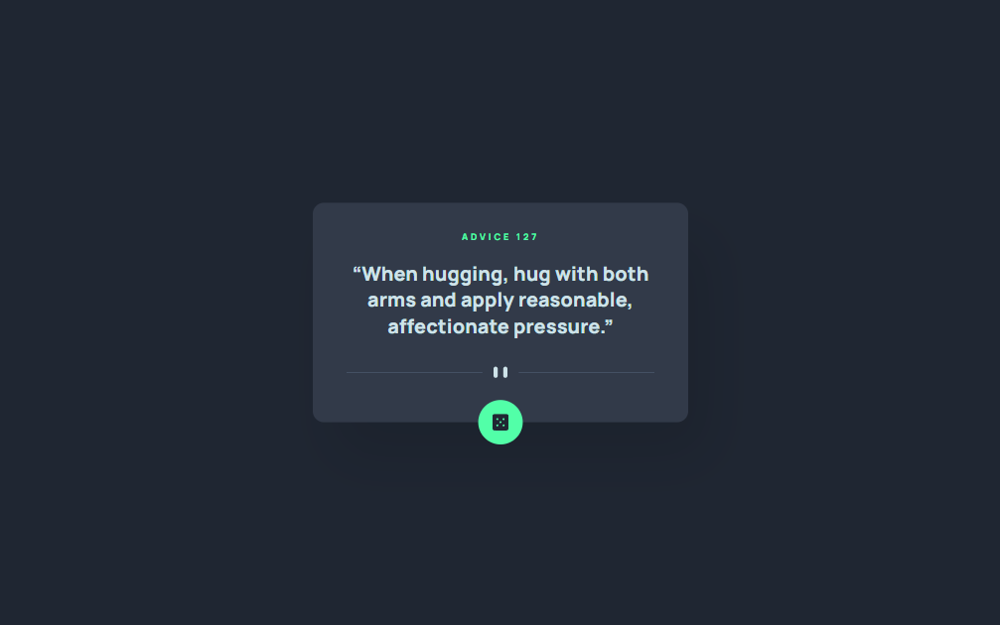

### The challenge

Users should be able to:

- View the optimal layout for the app depending on their device's screen size
- See hover states for all interactive elements on the page
- Generate a new piece of advice by clicking the dice icon

### Screenshot

### Links

- [Live](https://suite-landingpage.netlify.app/)
- [Solution](https://www.frontendmentor.io/solutions/tailwind-react-Wn_ZSfU9N)

### Built with

- HTML5
- CSS3
- Javascript
- Tailwind-css

## Author

- Frontend Mentor - [@Henryzheng](https://www.frontendmentor.io/profile/LonelyBuddy)
